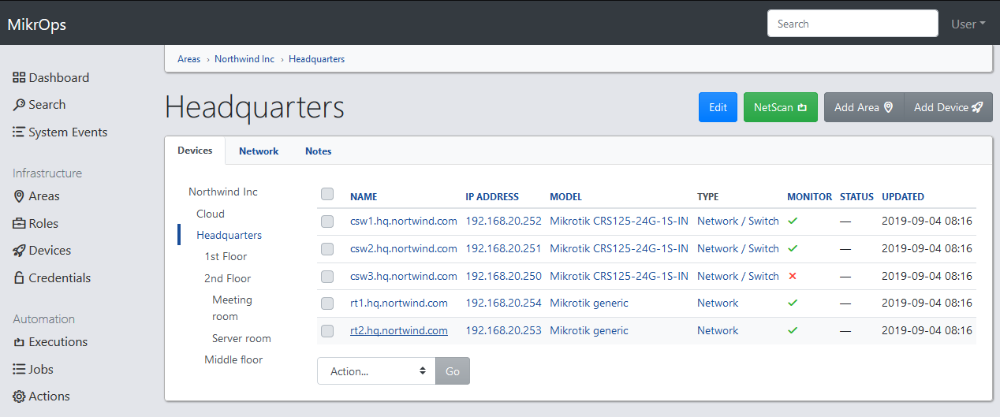
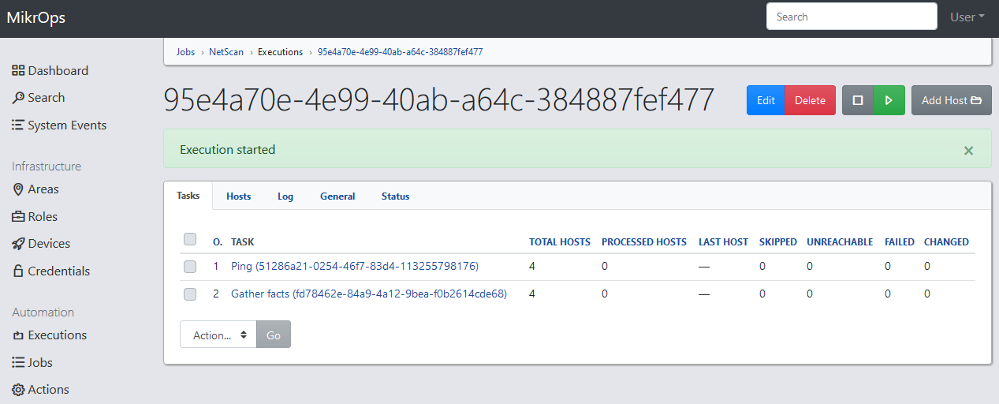
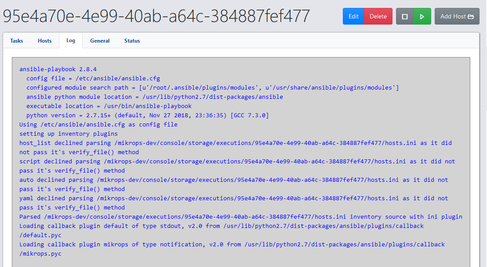

# MikrOps
A management UI for MikroTik Routers based onto Django.

MikrOps is a project that tries to bring together all those little services that usually we need to setup our network. DNS, Radius, Syslog, Ansible, etc.

Currently Syslog and Ansible are fully integrated and I am trying to close several small bugs and make the project presentable.

